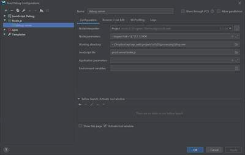

# Get started with the blog application
### Introduction
This Blog-application has been developed with the following technology-stack:
#### Backend
* Express.js (middleware, model-view-controller)
* Alasql.js (simple file-based database)
* Node.js (webbased backend infrastructure)

#### Frontend (external repo)
* Vue.js (component-based user-interfaces)
* babel (transpiler, compatibility of new ECMAScript 6 and higher to ECMAScript 5)


## Part 1: Installing the backend with a REST-API
### Prerequisite
You need to install [nodejs](https://nodejs.org/en/) in order to install the required infrastructure. With the installation of nodejs the tool `npm` (Node package manager) is included.

### Remarks for MacOS-users
When using  `npm` on the command line the usage differs on Windows and MacOS based platforms.
#### Windows 
On Windows you can use the `npm ...` straight away. Example: 
```
npm install
```
#### MacOS
On MacOS - if you open the terminal as non-administrator - then use it with the `sudo`-command 
Example: 
```
sudo npm install
``` 
and then type  in the administrator password. 
In the following installation guide the `sudo`-command is omitted. But be aware of the if you're an Apple user without default administrator privileges.

### Installation guide
Step 1: Clone the code from this repo from the command-line
```
git clone https://github.com/bzzlab/blog-ven-server.git
```
Step 2: Change into the app directory
```
cd blog-ven-server
```
Step 3: Install app dependencies
```
npm install
```
Step 4: Build application
```
npm run build-server
```
Step 5: Run application
```
npm run run-server
```

## Part 2: Testing the backend over the given REST-API

#### With curl
curl is command-line based tool which is to used to submit HTTP-requests and sending data to the backend 
(usually done via webform).
  
For GET-Requests:
```
curl -i -X GET http://localhost:3000/api/blog
```

For POST-Requests:
```
curl -i -d "@data.json" -X POST http://localhost:3000/api/blog
```
where data.json is:
```
{
  "key1":"value1",
  "key2":"value2"
}
```

For example:
```
{
"id": 1,
"nickname": "hans",
"title": "Dies ist ein Test.",
"content": "Dies ist ein Test."
}
```


#### With Postman
[Postman](https://www.getpostman.com/downloads/) is a tool for testing the backend API. The following show different requests

##### ORDER get
GET-Request: 
```
localhost:3000/api/blog
```

##### ORDER post
POST-Request: 
```
localhost:3000/api/blog
```
Data: 
```
{
"id": 1,
"nickname": "hans",
"title": "Dies ist ein Test.",
"content": "Dies ist ein Test."
}

```
Example response:
```
{
    "message": "We received your blog entry!",
    "id": "1"
}
```

### Tools, helpers and quirks
#### Which IDE (integrated development environment) is suitable?
There are a lot of good IDE's. The following ide are widespread
* [WebStorm](https://www.jetbrains.com/webstorm/) from Jetbrains (my preference)
* [Visual Studio Code](https://code.visualstudio.com/download) from Microsoft 


#### How to debug a node app?
See for details [here](https://nodejs.org/en/docs/guides/debugging-getting-started/). The important 
options is
```
--inspect-brk=127.0.0.1:3000
```
Blow the image *Edit Configuration ...* in WebStorm



#### Start building production code including a watch 
```
node_modules/.bin/babel dev-server --out-dir prod-server --watch
```

#### Setting development or production mode in package.json -> scripts
Setting the running mode differs between MacOS and Windows.  
* for MacOS
```
...
"temp": "export NODE_ENV=production  && nodemon prod-server/index.js"
...
```

* for Windows
```
...
"temp": "set NODE_ENV=production  && nodemon prod-server/index.js"
...
```


### Remarks on the used npm-modules
#### Express
You need `express` (so called middleware) for routing in the backend.
The command below installs `express` for the application and saves the dependency.
```
npm install express --save
```
#### Nodemon
Optional let's install `nodemon` (a tool for monitoring backend code). This tool restarts the server automatically when a change in the code has been detected.
This replaces a manual restart of the server.
The command below installs `nodemon` globally for this and all future applications. No dependency is needed.
```
npm install nodemon -g
```
#### Module import according to ECMAScript 6
In order to use the `import`-statement (instead of require) according to new ES2015+ (ES6) JavaScript
language standard, babel as transpiler is needed.
```
npm install --save-dev @babel/core @babel/cli @babel/preset-env
npm install --save @babel/polyfill
```
Create a config file named babel.config.js in the *root* of your project with this content:
```
const presets = [
  [
    "@babel/env",
    {
      targets: {
        edge: "17",
        firefox: "60",
        chrome: "67",
        safari: "11.1",
      },
      useBuiltIns: "usage",
    },
  ],
];

module.exports = { presets };
```

#### Concurrent execution of several npm modules
Execute more than one script at the same time (concurrent).
```
npm install concurrently --save-dev
```

#### Preventing CORS-error-messages
Install CORS (Cross-Origin Resource Sharing, see package info https://www.npmjs.com/package/cors, background see https://developer.mozilla.org/en-US/docs/Web/HTTP/CORS) and morgan (application logger, see package info https://www.npmjs.com/package/morgan) and save it to the *developer* dependencies.
```
npm install cors morgan --save-dev
```

#### Parsing requests and parameters
In order to parse (analysieren) incoming (HTTP) request bodies in a middleware before your handlers (available under the req.body property) we need to install body-parser (Body-parser in the http-request, see package info https://www.npmjs.com/package/body-parser) and save it to the *main* dependencies.
```
$ npm install body-parser --save
```


