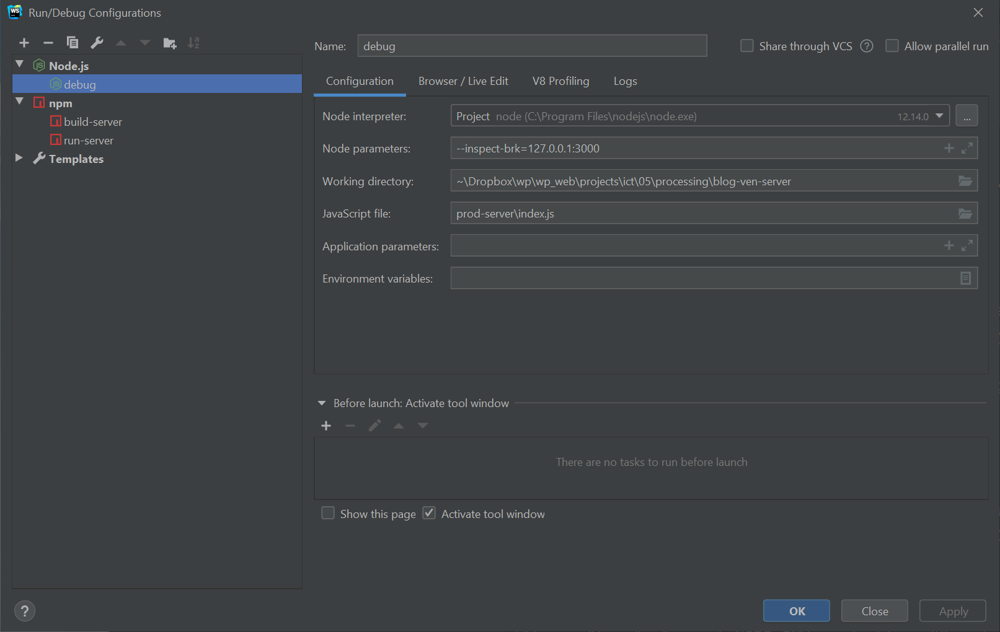

# Get started with the guestbook application
### Introduction
This guestbook application has been developed with the following technology-stack:
#### Backend (guestbook-mven-server)
* Express.js (middleware, model-view-controller)
* Alasql.js (simple file-based database)
* Node.js (webbased backend infrastructure)

#### Frontend (guestbook-mven-server)
* Vue.js (component-based user-interfaces)
* babel (transpiler, compatibility of new ECMAScript 6 and higher to ECMAScript 5)

>This step-by-step installation handles the backend (guestbook-mven-server)!  

#### Prerequisite
You need to install [nodejs](https://nodejs.org/en/) in order to install the required infrastructure. With the installation of nodejs the tool `npm` (Node package manager) is included.

##### Remarks for MacOS-users
When using  `npm` on the command line the usage differs on Windows and MacOS based platforms.
##### Windows 
On Windows you can use the `npm ...` straight away. Example: 
```
npm install
```
##### MacOS
On MacOS - if you open the terminal as non-administrator - then use it with the `sudo`-command 
Example: 
```
sudo npm install
``` 
and then type  in the administrator password. 
In the following installation guide the `sudo`-command is omitted. But be aware of the if you're an Apple user without default administrator privileges.

### Part 1: Cloning server and installing dependencies
Step 1: Clone the code from this repo from the command-line
```
git clone https://github.com/bzzlab/guestbook-mven-server.git
cd guestbook-mven-server
```
Step 2: Install app dependencies
```
npm install
```

### Part 2: Create database (if not already exists)
#### Prerequisite
1. MySQL is installed and running
2. DataGrip (by Jetbrains) installed

If one of these prerequisite are not met, then go to the missing lessons on 
http://ict.bzzlab.ch -> Ihr Jahrgang wählen. 

#### Steps
If guestbookdb does not already exists then ...

Step 1: Open Datagrip and connect to MySQL

Step 2: Execute the SQL-Scripts in the directory *sql* in the given order 
*guestbookdb-01.sql, guestbookdb-02.sql, guestbookdb-03.sql*.


### Part 2: Add program code for getting data (GET-Request)
#### Prerequisite
1. MySQL is installed and running
2. You've Webstrom (by Jetbrains) installed
3. You've database guestbookdb installed

If one of these prerequisite are not met, then go to the missing lessons on 
http://ict.bzzlab.ch -> Ihr Jahrgang wählen. 

#### Steps
Step 1: Open the project in Webstorm

Step 2: Search for Task-1 and add the code below. 
* It imports mysql as module
* It defines a connection and connects to the database
* It exports the connection-object for further use in other modules 
```
import mysql from 'mysql';
const dbConnection = mysql.createConnection(
    {host: 'localhost', user: 'root',
        password: 'Hello1234!',
        database: 'guestbookdb',
        insecureAuth : true
    });


dbConnection.connect(function(err) {
    if (err) throw err;
    console.log("Connected!");
});

export default dbConnection;
```

Step 3: Search for Task-2a and add the code below. 
* It imports the defined connection from previous step
```        
import dbConnection from "../../database-connection";
```

Step 4: Search for Task-2b and add the code below. 
* It defines the SQL query *abfrage* in order to fetch entries from the table *eintrag*
* It creates an array *liste* and pushes elements from the query *abfrage*
* It sends *liste* in JSON format to the client
```        
/**
 * Fetch all guestbook entries from the database
 * and send it to the client
 * @param req: request
 * @param res: response
 * @param next: next step
 * @returns {*}
 */
export function holeGuestbookEintraege(req, res, next) {
    //initialize an array called liste
    let liste = [];

    //define an sql-query
    const abfrage = "select * from eintrag;";
    try {
        //submit sql query stored in the string abfrage.
        dbConnection.query(abfrage, (fehler, reihen) => {
            if (fehler){
                console.error(fehler);
            }
            // iterate through all returned records stored in reihen
            for (let index in reihen){
                if (index == null){
                    throw new Error('index of getall is null')
                }
                let eintrag = reihen[index];
                liste.push({
                    "titel": "Test", //blog.titel,
                    "text": eintrag.text,
                    "autor": eintrag.autor,
                    "email": eintrag.email,
                    "datum": eintrag.datum
                })
            }
            //send to liste to the client
            return res.status(200).send(JSON.stringify(liste));
        });
    } catch (ex) {
        console.log(ex);
        next(ex);
        return res.status(500).send({message: 'index of getall is null'});
    }
}
```

Step 5: Search for Task-2c and add the code below. 
* It updates the route for the get request
```        
/**
 * get all guestbook entries
 */
router.get('/blog', controller.holeGuestbookEintraege);
```

### Part 3: Build
#### Steps
Step 1: Build application from Webstorm or from the console 
```
npm run build-server
```
Step 2: Run application from Webstorm or from the console
```
npm run run-server
```

## Part 4: Test
#### With curl
curl is command-line based tool which is to used to submit HTTP-requests and sending data to the backend 
(usually done via webform).
  
For GET-Requests:
```
curl -i -X GET http://localhost:3000/api/blog
```
#### With Postman
[Postman](https://www.getpostman.com/downloads/) is a tool for testing the backend API. The following show different requests

##### ORDER get
GET-Request: 
```
localhost:3000/api/blog
```

### Part 5: Add program code for posting and storing data 
#### Steps
Step 1: Open the project in Webstorm
Step 2: Search for Task-3a and add the code below. 

``` 
/**
 * Main function for getting/processing post data
 * @param req
 * @param res
 * @returns {*}
 */
export function erzeugeGuestbookEintrag(req, res, next) {
    //define sql-query
    const abfrage = "insert into eintrag set ?";
    try {

        let today = new Date();
        let heutigesDatum = today.getFullYear()+'-'+(today.getMonth()+1)+'-'+today.getDate();


        //submit sql query stored in the string abfrage.
        let neuerEintrag = {
            titel: req.body.titel.toLowerCase(),
            text: req.body.text.toLowerCase(),
            autor: req.body.autor.toLowerCase(),
            email: req.body.email.toLowerCase(),
            datum: heutigesDatum
        };

        dbConnection.query(abfrage, neuerEintrag, (fehler, resultat) => {
            if (fehler) {
                console.error(fehler);
            }
        });
        return res.status(201).json({
            message: `blog inserted with ${neuerEintrag.titel}!`
        });
    } catch (ex) {
        next(ex);
    }
}
``` 

Step 3: Search for Task-3b and add the code below. 
* It updates the route for the post request

```
/**
 * create a guestbook entry
 */
router.post('/blog', controller.erzeugeGuestbookEintrag);
```

### Part 6: Build
#### Steps
Step 1: Build application from Webstorm or from the console 
```
npm run build-server
```
Step 2: Run application from Webstorm or from the console
```
npm run run-server
```

## Part 7: Test
#### With curl
curl is command-line based tool which is to used to submit HTTP-requests and sending data to the backend 
(usually done via webform). See also in the directory test!
  
POST-Request for windows-user
```
post-1.bat
```

POST-Request for Mac-user
```
post-1.sh
```


### Tools, helpers and quirks
#### Which IDE (integrated development environment) is suitable?
There are a lot of good IDE's. The following ide are widespread
* [WebStorm](https://www.jetbrains.com/webstorm/) from Jetbrains (my preference)
* [Visual Studio Code](https://code.visualstudio.com/download) from Microsoft 


#### How to debug a node app?
See for details [here](https://nodejs.org/en/docs/guides/debugging-getting-started/). The important 
options is
```
--inspect-brk=127.0.0.1:3000
```
Blow the image *Edit Configuration ...* in WebStorm



#### Start building production code including a watch 
```
node_modules/.bin/babel dev-server --out-dir prod-server --watch
```

#### Setting development or production mode in package.json -> scripts
Setting the running mode differs between MacOS and Windows.  
* for MacOS
```
...
"temp": "export NODE_ENV=production  && nodemon prod-server/index.js"
...
```

* for Windows
```
...
"temp": "set NODE_ENV=production  && nodemon prod-server/index.js"
...
```


### Remarks on the used npm-modules
#### Express
You need `express` (so called middleware) for routing in the backend.
The command below installs `express` for the application and saves the dependency.
```
npm install express --save
```
#### Nodemon
Optional let's install `nodemon` (a tool for monitoring backend code). This tool restarts the server automatically when a change in the code has been detected.
This replaces a manual restart of the server.
The command below installs `nodemon` globally for this and all future applications. No dependency is needed.
```
npm install nodemon -g
```
#### Module import according to ECMAScript 6
In order to use the `import`-statement (instead of require) according to new ES2015+ (ES6) JavaScript
language standard, babel as transpiler is needed.
```
npm install --save-dev @babel/core @babel/cli @babel/preset-env
npm install --save @babel/polyfill
```
Create a config file named babel.config.js in the *root* of your project with this content:
```
const presets = [
  [
    "@babel/env",
    {
      targets: {
        edge: "17",
        firefox: "60",
        chrome: "67",
        safari: "11.1",
      },
      useBuiltIns: "usage",
    },
  ],
];

module.exports = { presets };
```

#### Concurrent execution of several npm modules
Execute more than one script at the same time (concurrent).
```
npm install concurrently --save-dev
```

#### Preventing CORS-error-messages
Install CORS (Cross-Origin Resource Sharing, see package info https://www.npmjs.com/package/cors, background see https://developer.mozilla.org/en-US/docs/Web/HTTP/CORS) and morgan (application logger, see package info https://www.npmjs.com/package/morgan) and save it to the *developer* dependencies.
```
npm install cors morgan --save-dev
```

#### Parsing requests and parameters
In order to parse (analysieren) incoming (HTTP) request bodies in a middleware before your handlers (available under the req.body property) we need to install body-parser (Body-parser in the http-request, see package info https://www.npmjs.com/package/body-parser) and save it to the *main* dependencies.
```
$ npm install body-parser --save
```


